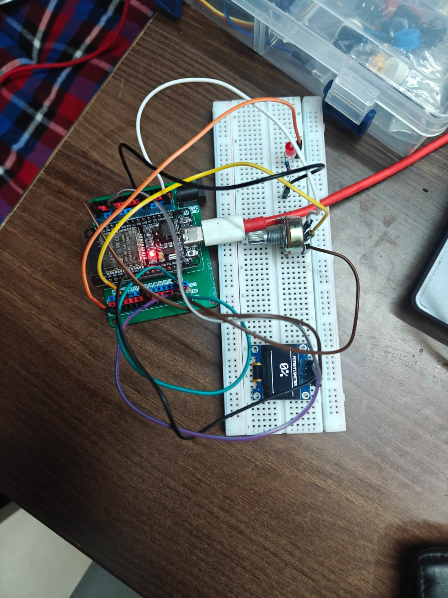

```markdown
# 🎛️ ESP32 Potentiometer Project - Version 3

## 📌 Overview

Version 3 expands the potentiometer project by using the analog input from the potentiometer to directly control the brightness of an LED using **PWM (Pulse Width Modulation)**.

The ESP32 reads the potentiometer through its built-in ADC and maps the resulting value to both an LED brightness level and a percentage value. The LED brightness changes smoothly as the potentiometer is rotated, while the OLED displays the corresponding brightness percentage and a graphical progress bar.

This version combines **ADC input** with **PWM output**, connecting the concepts learned in the Potentiometer Project with those previously explored in the PWM LED Dimmer project.

---

## 🎯 Objectives

- Read analog input from a 10kΩ potentiometer.
- Convert ADC readings into PWM duty-cycle values.
- Control LED brightness using the potentiometer.
- Display the brightness percentage on the OLED.
- Represent the brightness using a graphical progress bar.
- Understand how an analog input can control an output device.

---

## 🛠️ Components Used

- ESP32 Development Board
- 10kΩ Potentiometer
- External LED
- 220Ω Resistor
- 0.96" SSD1306 OLED Display (I²C)
- Breadboard
- Jumper Wires

---

## 🔌 Circuit Connections

### Potentiometer

| Potentiometer Pin | ESP32 |
|-------------------|--------|
| Left Pin | 3.3V |
| Middle Pin (Wiper) | GPIO 34 |
| Right Pin | GND |

### LED

| LED Connection | ESP32 |
|----------------|-------|
| Anode (+) through 220Ω resistor | GPIO 4 |
| Cathode (-) | GND |

### OLED Display

| OLED Pin | ESP32 |
|----------|-------|
| VCC | 3.3V |
| GND | GND |
| SDA | GPIO 21 |
| SCL | GPIO 22 |

> **Note:** If rotating the potentiometer clockwise decreases the LED brightness instead of increasing it, the 3.3V and GND connections on the outer potentiometer pins can be swapped.

---

## ⚙️ How It Works

- The potentiometer acts as a variable voltage divider.
- Rotating the potentiometer changes the voltage at its middle wiper pin.
- GPIO 34 reads this voltage using the ESP32's built-in ADC.
- The 12-bit ADC produces a value between approximately **0 and 4095**.
- The ADC value is mapped to an **8-bit PWM range of 0 to 255**.
- The ESP32 generates a PWM signal on GPIO 4 to control the LED brightness.
- The same ADC reading is also mapped to a percentage between **0% and 100%**.
- The OLED displays the percentage and a graphical progress bar.
- As the potentiometer is rotated, the LED brightness and OLED display update together.

---

## 🔄 ADC to PWM Mapping

The potentiometer produces an ADC value between **0 and 4095**, while the 8-bit PWM output uses values between **0 and 255**.

| ADC Value | Approx. PWM Value | Brightness |
|-----------|-------------------|------------|
| 0 | 0 | 0% |
| 1024 | 64 | 25% |
| 2048 | 128 | 50% |
| 3072 | 191 | 75% |
| 4095 | 255 | 100% |

This allows the full movement of the potentiometer to control the complete brightness range of the LED.

---

## ⚡ PWM Configuration

The LED is controlled using the ESP32's PWM functionality.

The PWM output is configured with:

- **Frequency:** 5000 Hz
- **Resolution:** 8-bit
- **Duty Cycle Range:** 0–255

The LED pin is configured for PWM using `ledcAttach()`, while `ledcWrite()` updates the duty cycle according to the potentiometer position.

---

## 📚 Concepts Learned

- Analog-to-Digital Conversion (ADC)
- Reading Analog Inputs using `analogRead()`
- Pulse Width Modulation (PWM)
- PWM Frequency and Resolution
- Configuring PWM using `ledcAttach()`
- Controlling PWM Duty Cycle using `ledcWrite()`
- Mapping ADC Values to PWM Values
- Controlling an Output using an Analog Input
- Percentage Conversion
- OLED Progress Bar Visualization
- Combining Previously Learned Embedded Systems Concepts

---

## 💡 Challenges Faced

- Mapping the 12-bit ADC range of **0–4095** to the 8-bit PWM range of **0–255**.
- Understanding the relationship between PWM duty cycle and perceived LED brightness.
- Configuring the LED pin correctly for PWM operation.
- Synchronizing the LED brightness with the percentage displayed on the OLED.
- Maintaining a responsive OLED display while continuously updating the PWM output.

---

## 🚀 Future Improvements

- Use the potentiometer to control an RGB LED.
- Control individual RGB color channels using PWM.
- Display the selected RGB color on the OLED.
- Smooth fluctuating ADC readings using averaging.
- Experiment with different PWM frequencies and resolutions.
- Use the potentiometer as an input device for menu navigation.

---

## 📷 Project Images

### Circuit Setup



### Project Demonstration


---

## ✅ Conclusion

Version 3 combines **analog input processing and PWM output control** by using a potentiometer to adjust the brightness of an LED.

The ESP32 reads the potentiometer through its ADC, processes the reading, and converts it into both a PWM duty-cycle value and a percentage for the OLED display. This demonstrates how a microcontroller can take a continuously varying physical input, process it, and use the result to control an output device in real time.

This version also reinforces concepts from the earlier PWM LED Dimmer project while introducing the important relationship between **ADC input and PWM output**, forming a strong foundation for controlling more complex devices in future embedded systems projects.
```
